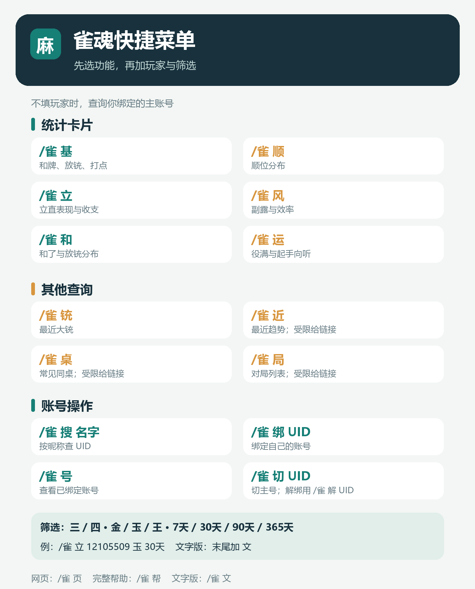
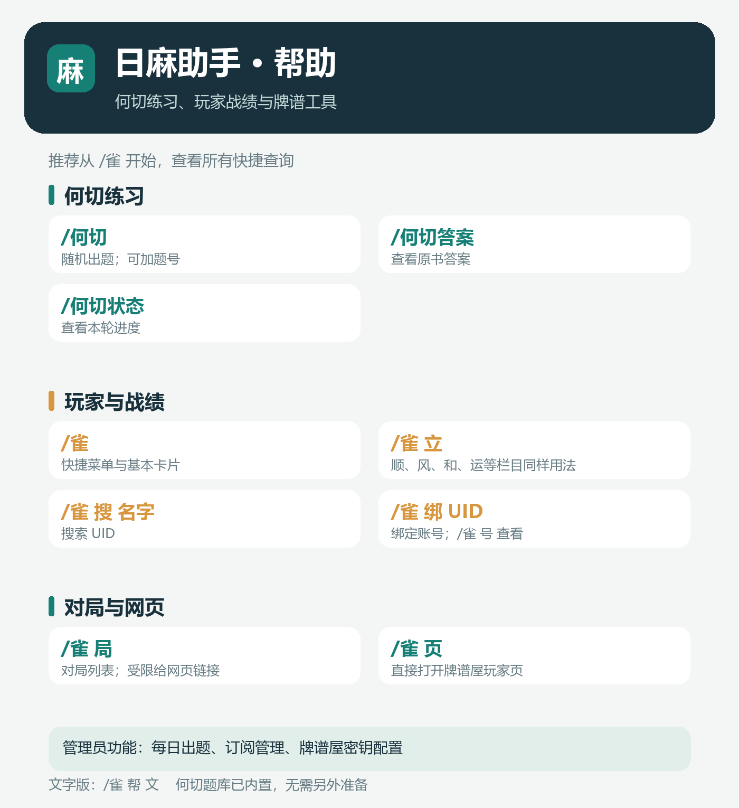

# 机器人功能手册

> 适用于 2026-09-23 服务器上运行的 AstrBot + NapCat 版本。当前启用：日麻助手 `0.3.1`、API 娱乐插件 `v3.1.2`、带歌单的 bili 播放器 `0.2.5+playlist.1`。图片用于说明界面；示例玩家统计并非实时战绩，娱乐菜单中的项目数量会随配置变化。

这台机器人主要提供 **何切练习、雀魂战绩查询、B 站点歌与个人歌单、娱乐 API**。新用户可以先发送 `/雀` 看日麻菜单，发送 `/娱乐` 看娱乐菜单，或发送 `/歌单` 看自己的收藏。AstrBot 自带的 `/help` 是全局命令列表；日麻插件的完整图片帮助请用 `/雀 帮` 或 `/何切 帮`。



## 1. 何切练习

题库已经内置《何切300》和《何切301》的 **601 道题**，无需另外上传题库。机器人发送原书题面；讨论后再查看对应的原书答案图。它不会自动判断群友切牌是否正确。

| 发送内容 | 作用 |
| --- | --- |
| `/何切` | 随机出一题；同一会话的一轮 601 题不会重复，抽完后开始下一轮。 |
| `/何切 123` | 查看第 123 题，并设为当前题；不消耗随机题堆。题号范围为 1～601。 |
| `/何切答案` | 查看当前题的原书答案与说明。 |
| `/何切答案 123` | 直接看指定题号的答案，不更改当前题。 |
| `/何切状态` | 查看当前题、轮次、剩余题数和每日出题状态。 |
| `/何切 帮` | 图片帮助；`/何切 文` 返回可复制的文字版。 |

题面示例（第 1 题）：


查看答案后的原书裁图示例：


群聊和私聊分别记录当前题与出题进度。题图会在发送前放大并轻度锐化，首次生成后缓存为 PNG；放大有助于阅读，但不能凭空补回原书扫描中不存在的细节。

管理员还可发送 `/何切自动 开启 19:30`，让当前群或私聊每天 19:30 自动出一题；`/何切自动 关闭` 停用，`/何切重置` 重置当前会话的随机轮次。服务器停机期间错过的每日题不会补发。

## 2. 雀魂账号与战绩

数据来自[牌谱屋](https://amae-koromo.sapk.ch/)的公开统计。先绑定账号，之后不填玩家时便会查询自己的主账号。

```text
/雀 搜 玩家昵称      # 查找 UID
/雀 绑 12105509    # 绑定 UID
/雀 号             # 查看已绑定账号
/雀 切 12105509    # 多账号时切换主账号
/雀 解 12105509    # 解除指定绑定
```

不绑定也可以直接查：`/雀 12105509` 或 `/雀 基 12105509`。昵称可能重名，确定玩家身份后使用 UID 更稳妥。绑定属于发命令的用户，不会替群里其他人改动账号。

### 统计卡片与筛选

| 命令 | 内容 |
| --- | --- |
| `/雀 基` | 基本表现：场数、平均顺位、和牌率、放铳率、打点等。 |
| `/雀 顺` | 一至四位分布与顺位相关数据。 |
| `/雀 立` | 立直率、立直收支等。 |
| `/雀 风` | 牌风与副露、效率相关统计。 |
| `/雀 和` | 和了和放铳分布。 |
| `/雀 运` | 血统：役满、起手向听等。 |
| `/雀 铳` | 最近大铳记录。 |
| `/雀 文` | 可复制的文字菜单；单项统计在命令末尾加 `文` 可取文字数据，如 `/雀 立 文`。 |

默认返回高清 PNG 卡片。下面两张是用示例数据生成的版式图，实际数字以查询时的牌谱屋结果为准。


筛选项可放在命令末尾，顺序不限：`三` / `四`（三麻、四麻），`金` / `玉` / `王`（场次），`7天` / `30天` / `90天` / `365天`（时间）。例如：

```text
/雀 立 12105509 玉 30天
/雀 顺 12105509 三 金 90天
/雀 基 文
```

牌谱屋主要收录金之间及以上的公开段位场；低段位玩家、非收录场次或尚未产生公开数据的账号可能查不到。

### 对局、趋势和网页

| 命令 | 作用 |
| --- | --- |
| `/雀 局 12105509 四 2` | 查询四麻对局列表第 2 页。 |
| `/雀 近` | 近期对局趋势。 |
| `/雀 桌` | 常见同桌玩家。 |
| `/雀 页 12105509` | 直接取得牌谱屋玩家页链接。 |

牌谱屋可能要求浏览器完成验证。接口触发限制时，`/雀 局`、`/雀 近`、`/雀 桌` 会返回玩家页链接，请用户自己打开网页查看；这不代表机器人自动读取了网页内容。公开统计卡片通常仍可查询。对局订阅依赖对局接口，遇到同样限制时也无法自动播报。

## 3. B 站点歌与歌单

播放器从 Bilibili 搜索视频，按用户选择发送可播放音频、视频或音频文件。搜索结果最多展示 10 个候选，选择时会锁定具体视频及分 P。

```text
搜索歌曲 晴天        # 展示候选
1                    # 默认交付方式取决于播放器配置
1 音频               # 播放选中的音频
1 音频下载           # 发送音频文件
搜索视频 BV号        # 按视频或分 P 选择
取消                 # 结束本次候选选择
```

启用支持工具调用的模型后，也可以尝试“我要听晴天”“我要看晴天”等自然语言点播；模型不可用时，请使用上面的明确命令。

### 收藏一次，下次直接播放


| 命令 | 作用 |
| --- | --- |
| `/歌单` | 查看当前歌单及序号。 |
| `/歌单 加 1` | 把最近搜索结果中的第 1 首加入歌单；搜索结果需要在 5 分钟内使用。 |
| `/歌单 加` | 收藏刚播放的那首。 |
| `/歌单 播 1` | 直接播放歌单第 1 首，不重新搜索，也不要求再次选歌。 |
| `/歌单 删 1` | 删除歌单第 1 首。 |

歌单默认**每人独立**，重启后仍保留。管理员可以在播放器配置里改成“群聊共用歌单”，此时群内共用，私聊仍使用个人歌单。歌单保存 B 站视频与分 P 标识；再次播放会重新获取媒体地址，因此视频被删除、变成会员专享或无法访问时仍可能播放失败。

语音默认最长 15 分钟、25 MiB；超出限制或平台不支持时，插件会尝试改发音频文件。视频和音频文件的大小上限由插件配置决定。B 站登录不是普通点播的必需条件，但受限内容可能需要管理员在 AstrBot 插件页面扫码或导入凭据。媒体能否最终送达还取决于 B 站权限、网络、`ffmpeg` 与 QQ/NapCat 适配器限制。

## 4. 娱乐 API

娱乐插件的触发范围与其他功能不同：**私聊直接发送；群聊必须在同一条消息中 @机器人**。这条限制同样适用于 `/娱乐` 菜单和娱乐关键词。群里只发“讲个笑话”而不 @，娱乐插件不会响应。


| 发送内容 | 作用 |
| --- | --- |
| `/娱乐` | 图片总菜单。 |
| `/娱乐 文字`、`/娱乐 图片` | 查看对应分类的可用项目。 |
| `/娱乐 视频`、`/娱乐 语音` | 查看对应分类的可用项目。 |
| `/查看api` | 查看当前 API 列表；`/查看api 名称` 看某项的详细参数。 |
| `讲个笑话`、`看看猫猫` | 触发已启用的对应 API；群聊需加 @。 |

示例：群里发送 `@机器人 /娱乐 图片`，再发送 `@机器人 看看猫猫`；私聊可省略 @。菜单只显示当前用户有权使用且已启用的项目。外部 API 由第三方站点提供，部分项目可能需要参数、密钥或暂时不可用；以实时菜单和返回结果为准。API 的启停和密钥配置由管理员在插件面板处理。

## 5. 菜单、权限与管理



| 身份 | 可做的事 |
| --- | --- |
| 普通用户 | 何切出题与看答案、绑定自己的雀魂账号、查询公开统计、点歌与维护自己的歌单、使用已开放的娱乐 API。 |
| AstrBot 管理员 | 另可重置何切轮次、设置每日出题、管理雀魂对局订阅、在私聊配置获准使用的牌谱屋 Token，以及管理娱乐 API 与播放器配置。 |

管理员版日麻帮助会多显示管理入口：[查看管理员菜单示例](images/日麻帮助-管理员.png)。管理员身份取决于 AstrBot 的管理员 ID 配置，并非仅凭 QQ 群管理员头衔自动获得。

对局订阅可用 `/雀魂订阅 UID`、`/三麻订阅 UID` 创建；`/雀魂订阅状态`、`/三麻订阅状态` 查看；`/开启雀魂订阅`、`/关闭雀魂订阅`、`/删除雀魂订阅` 管理四麻，三麻有对应的同名命令。首次订阅只记录最新对局作为起点，后续出现新对局才播报。若牌谱屋对局接口要求验证，订阅不能依靠普通网页链接自动运行。

机器人没有抽卡、签到、货币、商店或本地牌谱分析 API 功能。`/help` 保留给 AstrBot 全局帮助；日麻使用 `/雀 帮`，娱乐使用 `/娱乐`，播放器使用 `/歌单` 查看主要入口。

## 6. 安装与更新地址

- [日麻助手主分支](https://github.com/3137283455/astrbot_plugin_mahjong_helper)：何切题库和雀魂工具。
- [bili 播放器歌单分支](https://github.com/3137283455/astrbot_plugin_mahjong_helper/tree/music-player)：B 站点歌与持久歌单，基于 [57Darling02 的播放器](https://github.com/57Darling02/astrbot_plugin_bili_player) 修改。
- [API 娱乐插件上游](https://github.com/Zhalslar/astrbot_plugin_apis)：服务器上的版本额外配置了 @/私聊限制和图片菜单。

在 AstrBot 的插件管理中按需填入上述仓库地址安装。服务器当前三个插件已部署；这三个链接中，前两个是你 GitHub 上可直接拉取的插件代码，娱乐插件的服务器定制行为以当前部署为准。何切题库随日麻助手打包，用户不需要另找题库。

## 7. 常见情况

| 现象 | 说明与处理 |
| --- | --- |
| `/雀` 查不到自己 | 先 `/雀 搜 昵称` 找 UID，再 `/雀 绑 UID`；也可在命令中直接写 UID。 |
| 对局、趋势或同桌只返回网址 | 牌谱屋要求浏览器验证，打开返回的玩家页自行查看。 |
| 何切图仍有些糊 | 原书扫描图有上限；插件已做放大与锐化，可在配置中把放大倍率从 2 倍调至最高 4 倍。 |
| `/歌单 加 1` 提示没有序号 | 先 `搜索歌曲 关键词`；搜索候选超过 5 分钟需重新搜索。 |
| `/歌单 播 1` 失败 | 检查歌曲是否仍可访问、B 站播放权限、`ffmpeg`、网络和适配器媒体大小限制。 |
| 群里 `/娱乐` 没反应 | 在同一条消息里 @机器人；私聊不需要。 |

