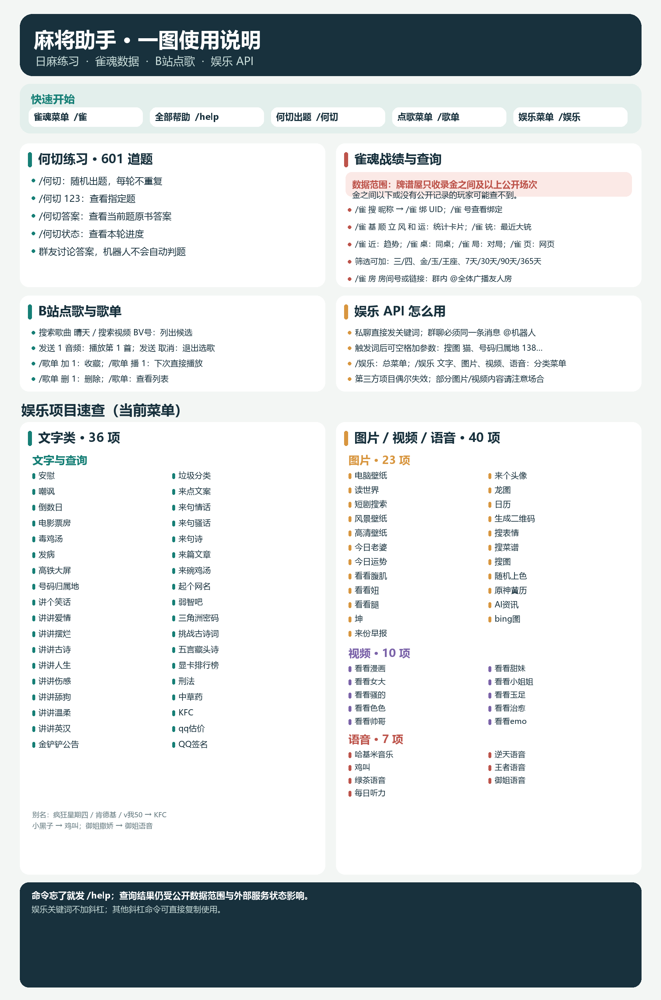
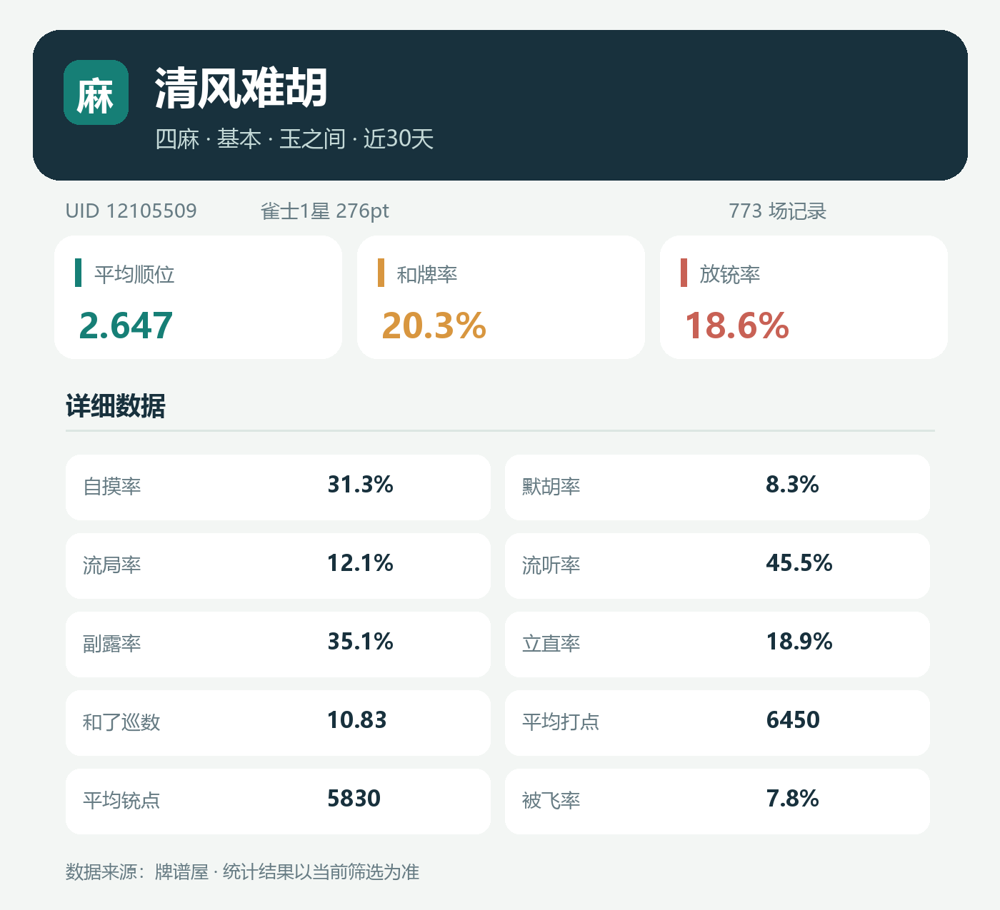
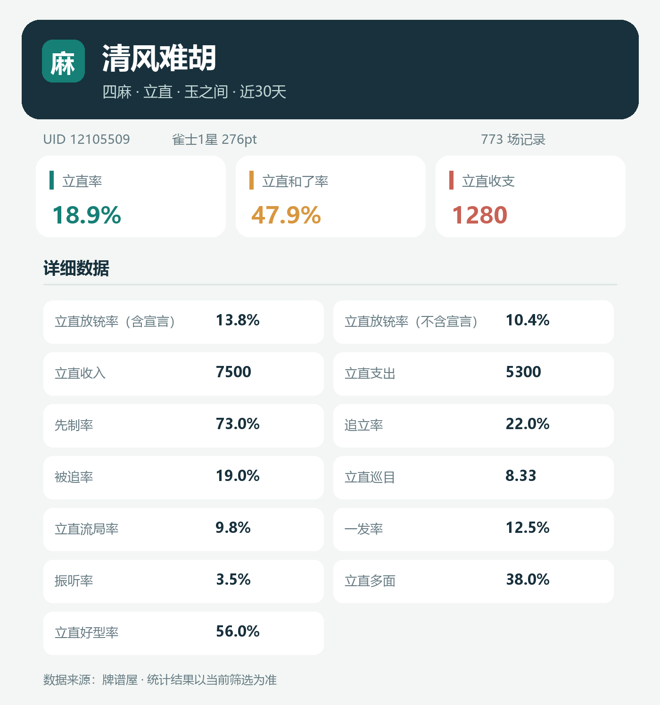
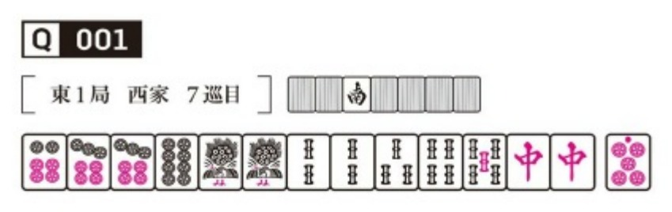
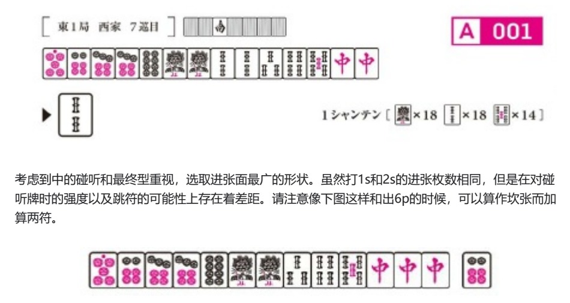
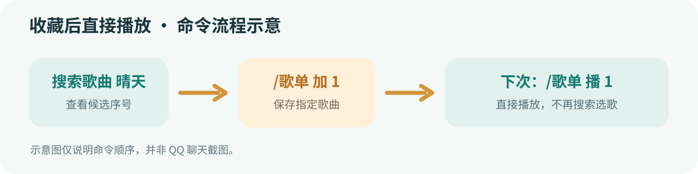
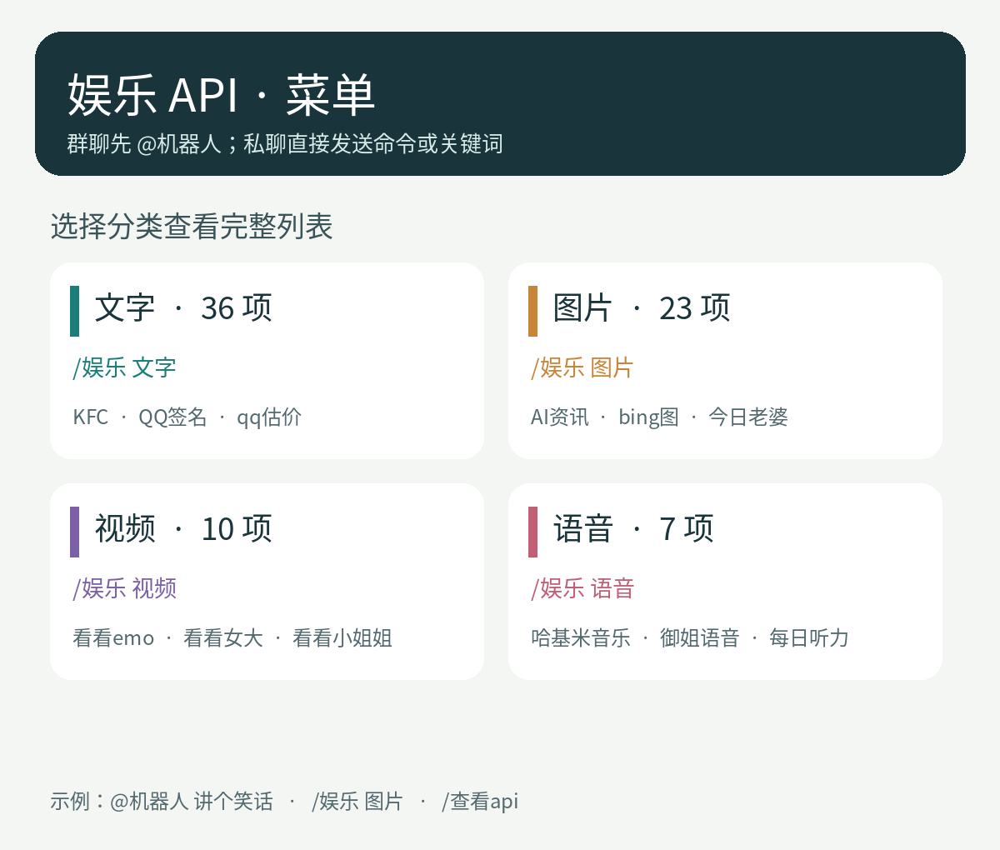

# 机器人使用手册

你好！这只机器人可以陪你做何切练习、查询雀魂战绩、点播 B 站歌曲和视频，也能提供文字、图片、视频和语音娱乐内容。

**发送 `/help` 或 `/帮助` 会收到一张完整功能长图。** 不记得具体命令时，可以直接发 `/help`；也可以按下面的分类逐项使用。



## 雀魂数据查询

### 友人房广播

在 QQ 群里建好雀魂友人房后，发送 `/雀 房 房间号或链接`，例如 `/雀 房 12345`。机器人会 @全体并发出你填写的内容；不需要写三麻或四麻。普通群成员也能使用。每个 QQ 用户第一次可立即发送，第二次至少间隔 5 分钟，第三次及以后每次至少间隔 15 分钟；换群也不会重置冷却。机器人需要在该群有发送 @全体的权限及剩余次数，发送失败不计入冷却。

> **数据范围请先看这里：牌谱屋目前只能查到金之间及以上的公开段位场数据。** 金之间以下的对局不会出现在这些统计中；如果账号没有公开牌局，即使 UID 正确也可能查不到。

### 第一次使用：绑定账号

```text
/雀 搜 玩家昵称
/雀 绑 12105509
```

先按昵称搜索，确认玩家 UID 后再绑定。这里的“绑定”只是为发送命令的 QQ 用户保存一个常用查询 UID，跨群共用；它不登录雀魂，也不验证账号归属。牌谱屋在三麻或四麻查到该 UID 的金之间及以上公开数据后才会保存。首次绑定会成为默认查询对象，之后新增 UID 不会自动切换。绑定后查询时可以省略 UID。

| 命令 | 作用 |
| --- | --- |
| `/雀 号` | 查看自己保存的常用查询 UID。 |
| `/雀 切 UID` | 切换常用账号。 |
| `/雀 解 UID` | 解除一个账号的绑定。 |
| `/雀 解 全部` | 清空自己的所有绑定；单独输入 `/雀 解` 不会清空。 |
| `/雀` | 查看雀魂功能菜单。 |
| `/雀 帮` | 查看雀魂和何切帮助卡片。 |

如果 `/雀 号` 中有“昵称未记录，请核对”，可能是旧版保存的记录，也可能是牌谱屋没有返回昵称；可先用 `/雀 UID` 核对，再按需删除。删除默认 UID 后，最早保存的剩余 UID 会自动成为默认查询对象。

### 战绩卡片

| 命令 | 内容 |
| --- | --- |
| `/雀 基` | 基本表现：平均顺位、和牌率、放铳率、打点等。 |
| `/雀 顺` | 一位到四位的分布。 |
| `/雀 立` | 立直相关表现。 |
| `/雀 风` | 副露和打牌效率相关数据。 |
| `/雀 和` | 和牌与放铳分布。 |
| `/雀 运` | 役满、起手向听等“血统”数据。 |
| `/雀 铳` | 最近的大铳记录。 |

不填 UID 时查询自己的常用账号。统计默认生成图片卡片；命令末尾加 `文` 可改为文字，例如 `/雀 立 文`。





推荐格式是 `/雀 玩家昵称 三/四 栏目 房间 时间`。玩家昵称放在前面，可以包含空格；后面的参数可以调换顺序。省略玩家昵称时查询已绑定的常用账号。

可以在昵称后添加这些条件：

- `三` / `四`：查询三麻 / 四麻。
- `基` / `顺` / `立` / `风` / `和` / `运` / `铳`：选择统计栏目。
- `金` / `玉` / `王`：筛选金之间 / 玉之间 / 王座之间。
- `7天` / `30天` / `90天` / `365天`：只看指定时间范围。

例如：

```text
/雀 一剑风起醉英豪 三 铳 30天
/雀 一剑风起醉英豪 30天 铳 三  # 与上一条相同
/雀 12105509 三 金 顺 90天
/雀 基 文
```

### 对局与玩家页面

```text
/雀 近                # 近期趋势
/雀 桌                # 常见同桌
/雀 12105509 局       # 最近对局
/雀 12105509 四 局 2  # 四麻第 2 页
/雀 12105509 页       # 打开牌谱屋玩家页面
```

牌谱屋有时会要求浏览器验证。此时机器人会返回玩家页链接，点开即可自行查看；这不表示机器人已经读取了网页里的受限对局。牌谱屋未收录的场次也不会显示。

## 何切练习

题库内置《何切300》和《何切301》，共 601 道题，不需要另外准备题库。机器人会发送题面图，方便群友讨论；它不会自动判断答案是否正确。

| 命令 | 作用 |
| --- | --- |
| `/何切` | 随机出题；当前一轮不会重复。 |
| `/何切 123` | 查看第 123 题。 |
| `/何切答案` | 查看当前题的原书答案。 |
| `/何切答案 123` | 查看指定题号的答案。 |
| `/何切状态` | 查看本轮进度。 |
| `/何切 帮` | 查看何切帮助图片。 |

题号范围为 1～601。题图会放大并轻度锐化；如果原书扫描底图本身模糊，清晰度仍会受原图影响。





## B 站点歌与歌单

### 搜索歌曲或视频

```text
搜索歌曲 晴天
1 音频

搜索视频 BV号
1
```

机器人会列出搜索候选，按序号选择。`1 音频` 表示播放第 1 项音频；单发 `1` 时按当前播放设置处理。发送 `取消` 可结束选歌。

如果已启用支持工具调用的聊天模型，也可以直接说“我要听晴天”或“我要看某某视频”。

### 收藏后直接播放



| 命令 | 作用 |
| --- | --- |
| `/歌单` | 查看歌单和歌曲序号。 |
| `/歌单 加 1` | 收藏最近一次搜索结果的第 1 首。 |
| `/歌单 加` | 收藏刚播放的歌曲。 |
| `/歌单 播 1` | 直接播放歌单第 1 首，不需要重新搜索。 |
| `/歌单 删 1` | 删除歌单第 1 首。 |

歌单默认每人一份。如果群主设置了群共享，群聊成员会共用一份歌单；私聊仍是个人歌单。搜索结果需在 5 分钟内收藏，超时后重新搜索即可。歌曲或视频被删除、需要登录权限或暂时无法访问时，可能无法播放。

## 娱乐功能

娱乐功能包含文字、图片、视频、语音四类。可以先看总菜单或分类菜单；下面列出当前已开放的全部项目，菜单会随项目调整。



### 怎么触发

- **私聊**：直接发送关键词，例如 `讲个笑话`、`看看猫猫`。
- **群聊**：必须在同一条消息中 @机器人，再发送关键词，例如 `@机器人 讲个笑话`。
- 娱乐关键词**不加斜杠**。需要参数的项目，在关键词后空一格再输入内容，例如 `搜图 猫`、`号码归属地 13800138000`、`生成二维码 https://example.com`。
- `/娱乐` 打开图片总菜单；`/娱乐 文字`、`/娱乐 图片`、`/娱乐 视频`、`/娱乐 语音` 查看分类菜单。

### 文字类（36 项）

`安慰`、`嘲讽`、`倒数日`、`电影票房`、`毒鸡汤`、`发病`、`高铁大屏`、`号码归属地`、`讲个笑话`、`讲讲爱情`、`讲讲摆烂`、`讲讲古诗`、`讲讲人生`、`讲讲伤感`、`讲讲舔狗`、`讲讲温柔`、`讲讲英汉`、`金铲铲公告`、`垃圾分类`、`来点文案`、`来句情话`、`来句骚话`、`来句诗`、`来篇文章`、`来碗鸡汤`、`起个网名`、`弱智吧`、`三角洲密码`、`挑战古诗词`、`五言藏头诗`、`显卡排行榜`、`刑法`、`中草药`、`KFC`、`qq估价`、`QQ签名`。

例子：`讲个笑话` 取一条笑话；`起个网名 小林` 按内容生成网名；`号码归属地 13800138000` 查询号码归属地；`高铁大屏 北京` 查询站点信息。`KFC` 也可用 `疯狂星期四`、`肯德基`、`v我50` 触发。

### 图片类（23 项）

`电脑壁纸`、`读世界`、`短剧搜索`、`风景壁纸`、`高清壁纸`、`今日老婆`、`今日运势`、`看看腹肌`、`看看妞`、`看看腿`、`坤`、`来份早报`、`来个头像`、`龙图`、`日历`、`生成二维码`、`搜表情`、`搜菜谱`、`搜图`、`随机上色`、`原神黄历`、`AI资讯`、`bing图`。

例子：`电脑壁纸` 获取壁纸；`搜图 猫` 搜索图片；`搜菜谱 番茄炒蛋` 搜菜谱；`生成二维码 https://example.com` 把文本或链接生成二维码。像“今日老婆”“看看腿”等内容可能不适合所有群聊，请按群规使用。

### 视频类（10 项）

`看看漫画`、`看看女大`、`看看骚的`、`看看色色`、`看看帅哥`、`看看甜妹`、`看看小姐姐`、`看看玉足`、`看看治愈`、`看看emo`。

例子：在允许的群聊中发送 `@机器人 看看治愈`。部分视频可能带有成人或暧昧内容，请遵守群规和平台要求。

### 语音类（7 项）

`哈基米音乐`、`鸡叫`、`绿茶语音`、`每日听力`、`逆天语音`、`王者语音`、`御姐语音`。

`鸡叫` 也可用 `小黑子` 触发；`御姐语音` 也可用 `御姐撒娇` 触发。部分项目会额外询问英雄名或其他参数。

### 参数与可用性

参数不足时，机器人可能会根据消息、@到的用户等内容补齐。各项目需要的参数不完全相同；不知道怎么填时，先发 `/娱乐` 查看菜单，或私聊机器人尝试。娱乐内容来自第三方服务，偶尔会失效、超时或返回空结果。

## 管理员专用

以下功能由机器人管理员设置，普通用户不用操作：

| 命令 | 用途 |
| --- | --- |
| `/何切自动 开启 19:30` / `/何切自动 关闭` | 设置或关闭当前群的每日何切。 |
| `/何切重置` | 重置当前群的一轮随机题目。 |
| `/雀魂订阅 UID` / `/三麻订阅 UID` | 订阅玩家的新对局。 |
| `/雀魂订阅状态` / `/三麻订阅状态` | 查看订阅。 |

订阅管理还支持 `/开启雀魂订阅 UID`、`/关闭雀魂订阅 UID`、`/删除雀魂订阅 UID`；三麻命令将“雀魂”替换为“三麻”。对局订阅也受牌谱屋可用数据限制。

## 遇到问题时

| 情况 | 处理方式 |
| --- | --- |
| 查不到雀魂玩家 | 确认 UID，并确认该玩家有金之间或以上的公开牌局。 |
| 对局查询只返回网页 | 打开链接，在牌谱屋网页中查看。 |
| 群聊娱乐命令没反应 | 在关键词前 @机器人；私聊不需要 @。 |
| 歌单提示没有这个序号 | 重新搜索，再发送 `/歌单 加 序号`。 |
| 收藏歌曲无法播放 | 原视频可能已删除、受权限限制或暂时不可用，换一个候选即可。 |
| 忘记命令 | 发送 `/help` 查看一图帮助。 |
